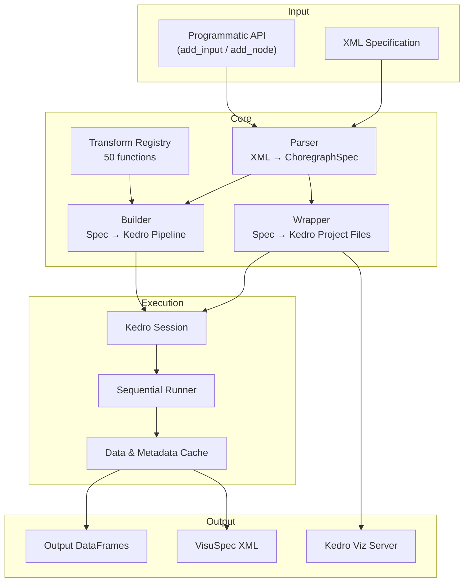

# Architecture

Choregraph bridges declarative XML pipeline specifications with Kedro's execution engine and DIVE's visualization kernel.

## Key Design Principles

**Single Source of Truth**
: The XML specification (or its in-memory `ChoregraphSpec` equivalent) drives everything. Kedro project files are generated automatically — never hand-edited.

**Lazy Evaluation**
: `run(lazy=True)` hashes the spec and input file timestamps. If nothing changed since the last run, cached results are returned immediately.

**Registry Pattern**
: All transform functions live in `TRANSFORM_REGISTRY`. The builder looks up functions by name when wiring pipeline nodes.

**Proxy Pattern**
: `_CacheProxy` makes the Choregraph instance behave like a Kedro `DataCatalog`, allowing `DiveConnector` to load datasets transparently through the cache layer.

---

- [Pipeline Flow](pipeline-flow.md) — Step-by-step execution walkthrough
- [XML Specification](xml-spec.md) — Schema and structure of pipeline XML
