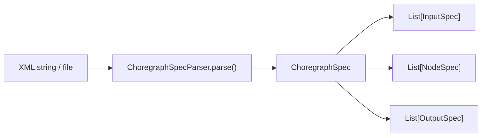

# Pipeline Flow

This page walks through the complete execution path from specification to output.

## 1. Specification Loading

When you create a `Choregraph` instance with an XML spec (or build one programmatically), the **Parser** converts it into a `ChoregraphSpec` — a set of Python dataclasses:

Each `NodeSpec` contains:

- **Input ports** — either connected to a data source (`source_ref`) or carrying a static parameter (`value`)
- **Output ports** — with unique IDs, labels, and visibility flags

## 2. Project Generation

The **Wrapper** (`ManagedProjectBuilder`) generates a complete Kedro project in a `.viz_wrapper` directory:

| Generated File | Purpose |
|----------------|---------|
| `pyproject.toml` | Kedro project metadata |
| `settings.py` | Kedro configuration (hooks, plugins) |
| `catalog.yml` | Dataset definitions (CSV, Parquet, Memory) |
| `pipeline_registry.py` | Pipeline module with node wiring |

Files are only written when their content changes (via `_write_if_changed`), preventing unnecessary Kedro Viz reloads.

## 3. Pipeline Building

The **Builder** converts the spec into a Kedro `Pipeline` object:

1. For each `NodeSpec`, look up the function in `TRANSFORM_REGISTRY`
2. Convert static port values to Python types using the XSD catalogue (float, int, bool, list)
3. Resolve `source_ref` connections to Kedro dataset names
4. Create Kedro `node()` calls with correct inputs, outputs, and function references

## 4. Execution

`Choregraph.run()` proceeds as follows:

1. **Hash check** — compute a hash from the XML spec content and input file modification times
2. **Short-circuit** — if hash matches the last run, return cached data immediately
3. **Generate** — call the Wrapper and Builder to produce Kedro project files and pipeline
4. **Run** — create a `KedroSession` and execute with `SequentialRunner`
5. **Cache** — store all output datasets in `_data_cache` and extract metadata into `_metadata_cache`

## 5. Data Access

After execution, datasets can be accessed through several methods:

- `get_dataset(data_id)` — looks up by ID in spec, then tries cache, parquet files, and catalog
- `list_data()` — returns all available dataset names, including multi-table Excel outputs
- `get_field_uniques()` — returns categorical field values from the metadata cache
- `get_datasets_metadata()` — returns full field-level statistics

## 6. DIVE Export

The **DiveConnector** translates cached data and metadata into VisuSpec XML:

1. Determine which datasets to include via `_get_outputs_allow_list()`
2. Extract field metadata (types, min/max, distinct counts, unique values)
3. Generate `specifications.xml` with `<rawData>` and `<fields>` sections
4. Optionally merge with an existing specifications file via `update_visuspec_xml()`
