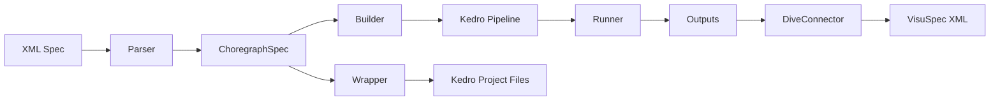

# Choregraph

**Graph-based data processing powered by Kedro**

Choregraph is a Python library that turns declarative XML pipeline specifications into executable [Kedro](https://kedro.org/) data pipelines. It provides 50 built-in transform functions, geolocation enrichment, NLP text processing, and direct export to the DIVE visualization kernel.

---

## Key Features

- **XML-driven pipelines** — Define inputs, transforms, and outputs in a portable XML specification
- **50 transform functions** — Filtering, aggregation, column/row operations, joins, normalization, discretization, and more.
- **Geo collection** — Geocode location names to coordinates; join country boundary polygons for map visualizations.
- **NLP collection** — Multi-label binarization with automatic language detection, lemmatization, and fuzzy matching.
- **Excel intelligence** — LLM-assisted detection and tidying of messy multi-table spreadsheets.
- **DIVE integration** — Export pipeline results to VisuSpec XML for the DIVE C++ visualization kernel.
- **Kedro Viz** — Built-in pipeline visualization server with custom styling.

---

## Architecture Overview



| Component | Role |
|-----------|------|
| **Parser** | Converts XML specification into in-memory `ChoregraphSpec` dataclasses |
| **Builder** | Translates `ChoregraphSpec` into a Kedro `Pipeline` with wired nodes |
| **Wrapper** | Generates a full Kedro project directory (catalog, settings, registry) |
| **Library** | Registry of 50 transform functions consumed by the builder |
| **DiveConnector** | Exports data and metadata to DIVE-compatible VisuSpec XML |

---

## Quick Example

```python
from choregraph import Choregraph

cg = Choregraph()
cg.add_input(id="sales", location="data/sales.csv", format="CSV")
cg.add_node(
    id="top10",
    type="get_top_n",
    input_ports=[
        InputPortSpec(name="df", source_ref="sales"),
        InputPortSpec(name="column", value="revenue"),
        InputPortSpec(name="n", value="10"),
    ],
)
result = cg.run()
df = cg.get_dataset("top10_result")
```

See the [Quick Start](getting-started/quickstart.md) guide for a full walkthrough.
